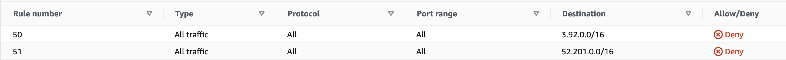

# Route 53 Application Recovery Controller with Simulated Region Failure

Using Route 53 for regional failover routing is a common pattern for disaster recovery (DR) events.  In the simplest case, we have the application deployed in a primary region and deployed (or quickly deployable) in a backup region.  We have a Route 53 DNS record set with both regions registered, and all traffic going to the primary region unless a health check fails.  In that case, the DNS record starts pointing to the backup region.

Relying on an automated health check to control regional failover can be tricky.  A health check may not be perfectly reliable if a region is experiencing some type of degradation.  Often we prefer to manually change the DNS records during failover.  But Route 53 is a global service with the control plane in the us-east-1 (N. Virginia) region.  What happens if that region is down?

Route 53 Application Recovery Controller (ARC) was built to handle this scenario.  ARC provides a health check that we can control manually, and controlling that health check to trigger a failover is a data plane operation.  ARC's data plane is highly resilient, using a cluster of five regional endpoints.  You can make change to the ARC health check as long as three of the five regions are available.

## Example application

Let's build an example with the application deployed in two regions in an active-active configuration.  This application runs a Tic-tac-toe game backed by a DynamoDB global table.

This application is based on the [GitHub repo](https://github.com/sebsto/tictactoe-cdk) backing the Route 53 ARC [blog](https://aws.amazon.com/blogs/aws/amazon-route-53-application-recovery-controller/).  It has minor changes to use a private Route 53 DNS zone rather than a public domain.  We also added an EC2 instance in a third region to act as a simulated end-user.

### Deploying the application

#### Login to AWS CloudShell in us-east-2 region

#### Install the latest version of NPM 

    sudo npm install -g npm 

#### Install CDK 2, if you haven't already done so 
    
    sudo npm install -g aws-cdk

#### first time only (one time operation)

    cd demo/app
    npm install && cdk bootstrap 

#### deploy the app 

    cdk deploy --all --outputs-file ../out.json --require-approval never

### Test regular endpoints

In the file `out.json`, you'll find the DNS entries for the load balancers in us-east-1 and us-west-2, in the property `LoadBalancerDNSName`.  You should be able to access either of these entries in a browser and see the app running.

### Set up DNS

Now we'll run three scripts to configure DNS and the ARC health check.

    cd ../scripts
    ./Route53-create-readiness-check.sh
    ./Route53-create-routing-controls.sh
    ./Route53-create-dns-records.sh

Log in to the [ARC console](https://us-west-2.console.aws.amazon.com/route53recovery/home#/recovery-control/home).  Go to the `TicTacToe-ControlPanel` and enable the routing control for us-east-1.  The control for us-west-2 should be disabled by default.

### Testing DNS

Log into the machine in us-east-2 using SSM.  Try to access the application via the private DNS record:

    curl TicTacToe.example.com

All replies should be from the application in us-east-1.  You can grep for the region in the response to verify:

    curl TicTacToe.example.com | grep us-

If you want to view the web interface, you can also use port forwarding via the client instance.

## Failover with Simulated Region Failure

In order to simulate failure, we'll first make it look like the application is down in us-east-1.  Then we'll disable API access in us-east-1. 

### Disable client traffic to us-east-1

First, we'll adjust network access control lists (NACLs) to deny traffic to us-east-1 from our client application.  From our client's perspective, the application is now down, and we should have some type of canary or synthetic monitoring set up to detect this.

To get started, find the public IP addresses used by the ALB in us-east-1 by running:

    aws ec2 describe-network-interfaces --filters Name=description,Values="ELB app/Ticta-TicTa*" --region us-east-1 | jq ".NetworkInterfaces[].Association.PublicIp"

You should see two IP addresses listed there.  Next we'll add a NACL rule to deny traffic to these IP addresses from our client.

* Go to the [VPC console](https://us-east-2.console.aws.amazon.com/vpc/home?region=us-east-2#) in us-east-2.
* Find the VPC named `TictactoeClientCdkStack/TicTacToeVPC`.
* Click on the `Main network ACL`.
* Click on `Outbound rules`.
* Add two new rules that deny traffic to the IP addresses for the ALB in us-east-1.

Log in to the client instance in us-east-2 using AWS Systems Manager Session Manager and try to access the application.  The request should time out.

### Disable API access in us-east-1

Now, we'll use a Service Control Policy (SCP) to disable any API calls in us-east-1.  Before we start, confirm that you can make a simple change to one of our Route 53 records.  

* Log in to the [Route 53 console](https://console.aws.amazon.com/route53/v2/hostedzones#)
* View the zone `example.com`
* Adjust the TTL for the `NS` record to some value other than the default value of `172800`.

Of course in a failover situation you'd want to update the records for the application endpoint, but what if you couldn't reach the Route 53 control plane?

Apply this SCP to the account you're using:

    {
        "Version": "2012-10-17",
        "Statement": [
            {
            "Sid": "DenyAccessToASpecificRole",
            "Effect": "Deny",
            "Action": [
                "iam:*",
                "route53:*"
            ],
            "Condition": {
                "StringEquals": {
                "aws:RequestedRegion": [
                    "us-east-1"
                ]
                }
            },
            "Resource": [
                "*"
            ]
            }
        ]
    }

**WARNING** - Do not apply this SCP to a production account.  It disables access to IAM and Route 53.  You must be an Organization administrator to remove this SCP later.

Go back to the console and confirm that you can no longer access Route 53 to make changes.  You should see messages like this in the console:

    AccessDenied 403: User: arn:aws:iam::XXX:user/YYY is not authorized to perform: route53:* with an explicit deny

### Failover

Log in to the [ARC console](https://us-west-2.console.aws.amazon.com/route53recovery/home#/recovery-control/home).  Go to the `TicTacToe-ControlPanel` and enable the routing control for us-west-2, and disable the control for us-east-1.  If the console is unavailable, you could use the highly reliable [cluster endpoints](https://docs.aws.amazon.com/r53recovery/latest/dg/route53-arc-best-practices.html) instead.

Log in to the client instance in us-east-2 using SSM and try to access the application.  The request should now succeed, served from us-west-2.

    curl TicTacToe.example.com
    curl TicTacToe.example.com | grep us-

All replies should now be from the application in us-west-2.  
